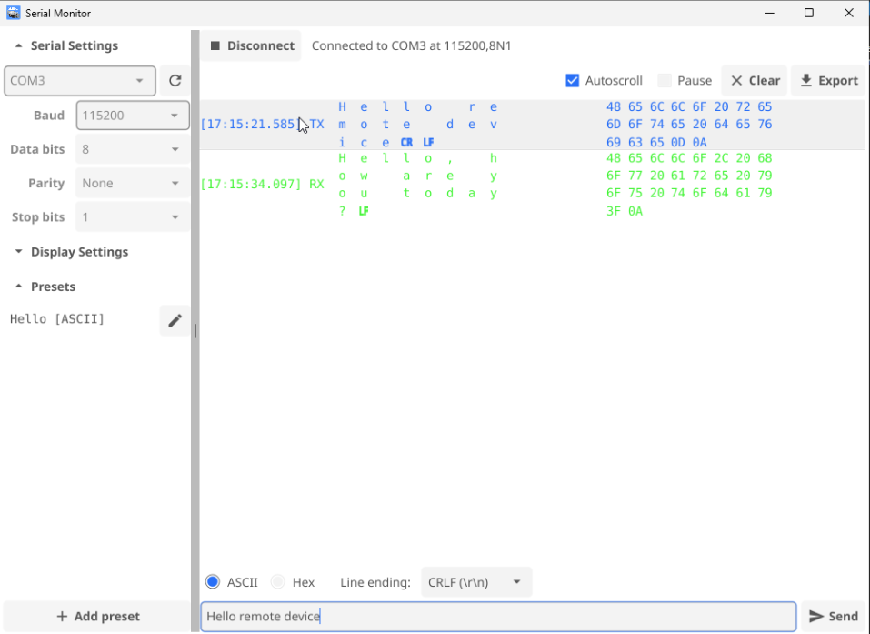
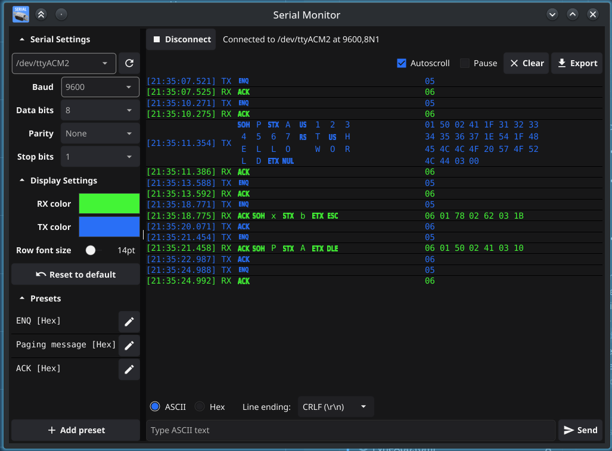

# Serial Monitor

A cross-platform serial port terminal for engineers, built with
[Fyne](https://fyne.io) and [go.bug.st/serial](https://github.com/bugst/go-serial).

## Screenshots

<table>
  <tr>
    <th width="50%">Windows</th>
    <th width="50%">Linux</th>
  </tr>
  <tr>
    <td width="50%">
      
    </td>
    <td width="50%">
      
    </td>
  </tr>
</table>

## Features

- Connect to any serial port with configurable baud rate, data bits, parity and stop bits.
- Live RX/TX monitor with per-line timestamps and side-by-side ASCII/hex
  columns; click either to copy. Customizable RX/TX colors and row font size, autoscroll/pause/clear controls.
- Send ad-hoc ASCII or hex data, with an optional line ending (none, LF, CR, CRLF) appended.
- Save, edit and delete reusable ASCII/hex snippets ("presets") and send any of them with one click. Presets persist between runs.
- Export the log as a `.pcapng` capture file, openable directly in Wireshark, with RX/TX tagged via packet direction.

## Building

```sh
go build .
```

### Linux

You'll usually need to be in the `dialout` (Debian/Ubuntu) or `uucp` (Arch) group to access `/dev/ttyUSB*`/`/dev/ttyACM*` without root:

```sh
sudo usermod -a -G dialout $USER   # then log out/in
```

### Windows / macOS

`go build .` works out of the box with a normal Go + gcc (macOS: Xcode
command line tools) install.
